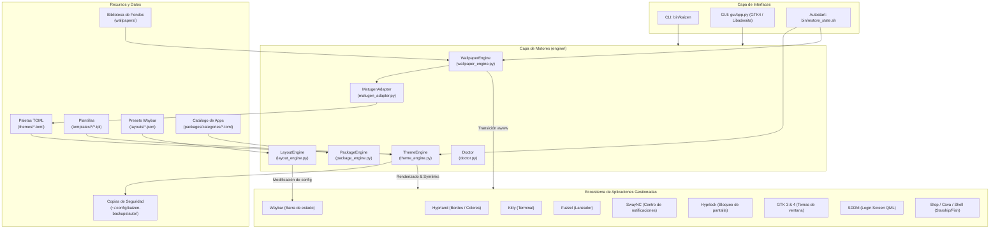

# 🏯 KAIZEN — Arquitectura y Documentación Técnica del Sistema

**Kaizen** es un ecosistema integral de personalización (*theming engine / rice manager*) diseñado específicamente para el compositor Wayland **Hyprland** sobre **Arch Linux** (y distribuciones derivadas). Su objetivo es unificar la configuración estética y funcional de múltiples componentes del entorno de escritorio bajo una sola fuente de verdad.

---

## 1. Visión General del Proyecto

En entornos basados en Wayland y gestores de ventanas dinámicos (*tiling window managers*), la configuración visual suele estar dispersa en múltiples archivos de formato heterogéneo (CSS, TOML, JSON, INI, scripts de shell, configuraciones de compositor, etc.).

Kaizen resuelve esto proporcionando:
- **Centralización**: Definición de paletas de color en formato estándar TOML (`themes/*.toml`).
- **Renderizado de Plantillas**: Generación dinámica y validada de configuraciones para cada aplicación (`templates/`).
- **Aplicación en Tiempo Real**: Enlaces simbólicos y recarga en caliente (*hot-reload*) de daemons y aplicaciones gráficas.
- **Generación Algorítmica de Temas**: Extracción automática de paletas a partir de imágenes de fondo utilizando `matugen` y algoritmos de colorimetría adaptativa en Pillow.
- **Gestión de Fondos con Transiciones**: Integración con el daemon `awww` / `swww` con transiciones animadas fluidas y biblioteca de miniaturas en caché.
- **Disposiciones Dinámicas de Barra**: Control de geometría y posición (*top*, *bottom*, *left*, *right*) para Waybar.
- **Gestión de Software**: Catálogo curado con detección en vivo del estado de instalación (`pacman -Qq`) y acciones Polkit dedicadas de Kaizen para transacciones de sistema.
- **Seguridad y Resiliencia**: Copias de seguridad automáticas con marcas de tiempo antes de cualquier modificación y soporte para rollback inmediato.

---

## 2. Diagrama de Arquitectura



---

## 3. Estructura de Directorios

```text
kaizen/
├── bin/                          # Puntos de entrada ejecutables y scripts
│   ├── kaizen                    # Interfaz de Línea de Comandos (CLI)
│   ├── kaizen-sddm-deploy.sh     # Despliegue SDDM invocado por el helper Polkit
│   ├── kaizen-privileged         # Helper root con operaciones Kaizen restringidas
│   ├── kaizen-yay-auth           # Adaptador Polkit limitado para yay
│   └── restore_state.sh          # Script de restauración de estado en el login
├── polkit/
│   └── io.github.kaizen.policy   # Acciones Polkit dedicadas
├── config/
│   └── kaizen.toml               # Configuración central de rutas y daemons
├── engine/                       # Motores de procesamiento
│   ├── theme_engine.py           # Renderizado de temas, symlinks, backups y recargas
│   ├── wallpaper_engine.py       # Biblioteca, miniaturas y transiciones de fondo
│   ├── matugen_adapter.py        # Generador de temas a partir de wallpapers
│   ├── layout_engine.py          # Modificador de geometría de Waybar
│   ├── package_engine.py         # Verificación e instalación de software
│   └── doctor.py                 # Diagnósticos de dependencias e integridad
├── gui/
│   └── app.py                    # Aplicación de escritorio GTK 4 / Libadwaita
├── layouts/                      # Presets de posición para Waybar
│   ├── top.json, bottom.json, left.json, right.json
├── packages/                     # Catálogo de software recomendado
│   ├── catalog.toml              # Metadatos del catálogo
│   └── categories/               # Categorías (browsers, dev-tools, hacking, etc.)
├── templates/                    # Plantillas parametrizadas con placeholders {{var}}
│   ├── btop/
│   ├── cava/
│   ├── fish/
│   ├── fuzzel/
│   ├── gtk/
│   ├── hyprland/
│   ├── hyprlock/
│   ├── kitty/
│   ├── sddm/
│   ├── starship/
│   ├── swaync/
│   └── waybar/
├── themes/                       # Paletas de color en formato TOML
│   ├── catppuccin-mocha.toml
│   ├── cyberpunk-neon.toml
│   ├── dracula.toml
│   ├── gruvbox-dark.toml
│   ├── nord.toml
│   ├── rose-pine.toml
│   ├── synthwave.toml
│   ├── tokyo-night.toml
│   └── ...
└── install.sh                    # Instalador global en el sistema
```

---

## 4. Descripción Detallada de Componentes

### 4.1. Motor de Temas (`engine/theme_engine.py`)
El motor de temas es el núcleo orquestador de Kaizen:
1. **Carga y Validación**: Lee la paleta seleccionada en `themes/<theme_id>.toml`. Valida la presencia de la sección `[colors]`.
2. **Construcción del Contexto**: Genera variables estándar en formato Hex (`#ffffff`) y variables derivadas sin `#` (`ffffff_raw`) necesarias para aplicaciones con sintaxis RGBA como Hyprland y CSS de Waybar.
3. **Copia de Seguridad Automática**: Antes de realizar cualquier cambio en el sistema, guarda una copia de todos los archivos de configuración activos en `~/.config/kaizen-backups/auto/<timestamp>`. Mantiene un historial de hasta 20 respaldos.
4. **Renderizado Seguro**: Itera por todas las plantillas de `templates/` sustituyendo las variables `{{variable}}`. Si se detecta algún marcador no resuelto, aborta la operación para evitar romper archivos del sistema.
5. **Symlinking**: Crea enlaces simbólicos hacia las rutas de configuración activas de usuario (`~/.config/waybar/`, `~/.config/kitty/`, `~/.config/hypr/`, etc.).
6. **Despliegue con Privilegios**: Para SDDM usa la acción `io.github.kaizen.sddm.deploy`, que llama a un helper restringido de Kaizen.
7. **Recarga en Caliente (*Hot-Reload*)**: Notifica a las aplicaciones abiertas mediante señales del sistema (`killall -SIGUSR2 waybar`, `hyprctl reload`, `swaync-client -R`, `killall -USR1 kitty`, `gsettings`).
8. **Gestión de Historial**: Permite regresar al tema inmediatamente anterior (`apply_previous`) o revertir al último respaldo (`rollback`).

### 4.2. Motor de Fondos de Pantalla (`engine/wallpaper_engine.py`)
- Mantiene la biblioteca de imágenes en `wallpapers/library/`.
- Genera miniaturas en caché en `wallpapers/thumbnails/` a 320x180 px utilizando Pillow (PIL) o ImageMagick.
- Aplica el fondo a través de `awww` / `swww` con transiciones configurables (`wipe`, `fade`, etc.).
- Persiste la ruta absoluta del fondo actual en `state/current_wallpaper`, sincroniza
  Hyprlock y prepara un asset para SDDM. `[wallpaper] lockscreen_path` y `sddm_path`
  en el tema son overrides opcionales; sin ellos ambos heredan el fondo del escritorio.

### 4.3. Adaptador Matugen (`engine/matugen_adapter.py`)
- Extrae la gama cromática de cualquier imagen utilizando la herramienta CLI `matugen` (Material You).
- Si `matugen` no está disponible, utiliza un algoritmo de cuantificación de color adaptativo con PIL para extraer los tonos dominantes y construir una paleta equilibrada (fondo, fondo alternativo, primer plano, acentos, colores funcionales de terminal).
- Guarda la paleta generada como un nuevo tema en `themes/auto-<nombre>.toml`.

### 4.4. Motor de Layouts (`engine/layout_engine.py`)
- Carga definiciones en JSON (`layouts/*.json`) con posiciones (`top`, `bottom`, `left`, `right`), alturas, anchos y márgenes.
- Modifica directamente la configuración activa de Waybar (`~/.config/waybar/config`) preservando los módulos existentes y actualizando solo la geometría.
- Reinicia Waybar para reflejar la disposición al instante.

### 4.5. Motor de Paquetes (`engine/package_engine.py`)
- Lee definiciones organizadas en `packages/categories/*.toml`.
- Consulta el estado de instalación en tiempo real usando `pacman -Qq <pkg>`.
- Permite instalar y desinstalar paquetes mediante las acciones `io.github.kaizen.package.install` y `.remove`. `yay` continúa construyendo AUR sin privilegios y delega solamente sus transacciones `pacman -S/-R` al adaptador limitado de Kaizen.

### 4.8. Polkit dedicado
`install.sh` instala `polkit/io.github.kaizen.policy` en
`/usr/share/polkit-1/actions/io.github.kaizen.policy` y el helper restringido en
`/usr/lib/kaizen/kaizen-privileged` (junto al adaptador `kaizen-yay-auth`). Las acciones son `io.github.kaizen.sddm.deploy`,
`io.github.kaizen.package.install` y `io.github.kaizen.package.remove`.

Usan `auth_admin_keep`, cuya autorización temporal de Polkit es breve (la referencia de
Polkit la describe como, por ejemplo, cinco minutos; no es persistente durante toda la
sesión). El helper solo admite el deploy SDDM desde el directorio Kaizen del
usuario y nombres de paquetes válidos; llama solo al script SDDM instalado y root-owned,
nunca a programas proporcionados por quien llama.
Tras actualizar Kaizen, vuelve a ejecutar `./install.sh` para reinstalar la política.

### 4.9. Hooks
Los hooks opcionales usan `hooks/pre_apply.sh` y `hooks/post_apply.sh` para operaciones
globales, y `themes/<id>/hooks/pre_apply.sh` y `post_apply.sh` para un tema. El orden es:
pre global → pre del tema → operación → post del tema → post global. Reciben
`KAIZEN_THEME_ID`, `KAIZEN_PREVIOUS_THEME_ID`, `KAIZEN_HOOK_PHASE`, `KAIZEN_OPERATION` y
`KAIZEN_BASE_DIR` (además de `KAIZEN_PRESET_ID` o `KAIZEN_PACKAGE_NAME` cuando aplica).
Cada resultado, incluida una falla, se registra en `state/hooks.log`; los hooks son
best-effort y no cancelan la operación principal.

### 4.10. Esquema de temas
El esquema actual es **v2**. La v2 formaliza las secciones `[icons]`, `[cursor]`,
`[font]` y `[gtk]` introducidas con el theming GTK de primera clase; por eso no se
considera v1. `ThemeEngine` migra en memoria temas v0/v1 añadiendo secciones y defaults
compatibles, sin reescribir temas de terceros. Un `schema_version` futuro se advierte y
se intenta cargar sin downgrade. `Doctor` muestra las mismas advertencias y Matugen
siempre genera temas con `schema_version = 2`.

### 4.6. Diagnósticos y Salud (`engine/doctor.py`)
Realiza una auditoría completa del entorno:
- Presencia de binarios esenciales (`waybar`, `hyprctl`, `kitty`, `fuzzel`, `awww`, `matugen`, `pkexec`, `magick`).
- Módulos de Python (`gi`, `tomllib`, `PIL`).
- Integridad de librerías gráficas (GTK4 y Libadwaita).
- Estructura de carpetas requeridas.
- Validación de sintaxis de todos los archivos TOML de temas.
- Validación de etiquetas en todas las plantillas `.tpl`.
- Estado de los enlaces simbólicos en `~/.config/`.
- Estado activo actual.

### 4.7. Interfaz Gráfica (`gui/app.py`)
Aplicación nativa moderna en **GTK 4** con compatibilidad para **Libadwaita**:
- **Pestaña de Temas**: Galería visual con tarjetas interactivas, paletas de color pintadas en tiempo real mediante Cairo (`Gtk.DrawingArea`), botón de aplicación en hilo separado (*multithreading*) para mantener la interfaz fluida, y botón de rollback.
- **Pestaña de Fondos**: Galería de wallpapers con miniaturas, selector de archivos nativo y generador de temas automáticos con un clic.
- **Pestaña de Layouts**: Selectores visuales para cambiar la orientación de Waybar.
- **Pestaña de Apps**: Tienda de aplicaciones categorizadas con insignias de estado (Instalado / No instalado) y botones de acción.
- **Pestaña de Atajos**: Hoja de referencia rápida de los atajos de teclado configurados en Hyprland.

---

## 5. Tabla de Integraciones y Destinos

| Componente / App | Archivo de Plantilla (`templates/`) | Archivo Destino Activo |
| :--- | :--- | :--- |
| **Hyprland** | `hyprland/colors.conf.tpl` | `~/.config/hypr/kaizen-colors.conf` |
| **Waybar** | `waybar/style.css.tpl` / `config.json.tpl` | `~/.config/waybar/style.css` / `config` |
| **Kitty Terminal**| `kitty/theme.conf.tpl` | `~/.config/kitty/theme.conf` |
| **Fuzzel Menu** | `fuzzel/fuzzel.ini.tpl` | `~/.config/fuzzel/fuzzel.ini` |
| **SwayNC** | `swaync/style.css.tpl` | `~/.config/swaync/style.css` |
| **Hyprlock** | `hyprlock/hyprlock.conf.tpl` | `~/.config/hypr/hyprlock.conf` — sincronizado al cambiar wallpaper |
| **GTK 3** | `gtk/gtk3.css.tpl` | `~/.config/gtk-3.0/gtk.css` |
| **GTK 4** | `gtk/gtk4.css.tpl` | `~/.config/gtk-4.0/gtk.css` |
| **SDDM Login** | `sddm/Main.qml.tpl` / `theme.conf.tpl` | `/usr/share/sddm/themes/corners/` — wallpaper sincronizado vía deploy Polkit |
| **Btop** | `btop/kaizen.theme.tpl` | `~/.config/btop/themes/kaizen.theme` |
| **Starship** | `starship/starship.toml.tpl` | `~/.config/starship.toml` |
| **Fish Shell** | `fish/kaizen-prompt.fish.tpl` | `~/.config/fish/kaizen-prompt.fish` |
| **Cava** | `cava/config.tpl` | `~/.config/cava/config` |

---

## 6. Referencia de Comandos CLI (`kaizen`)

| Comando | Parámetros | Descripción |
| :--- | :--- | :--- |
| `kaizen apply theme` | `<nombre-tema>` | Aplica la paleta de color y recarga el entorno. |
| `kaizen apply layout` | `<top\|bottom\|left\|right>` | Cambia la orientación y márgenes de Waybar. |
| `kaizen apply previous` | — | Regresa al tema inmediatamente anterior en el historial. |
| `kaizen rollback` | — | Restaura las configuraciones desde la última copia de seguridad. |
| `kaizen wallpaper set` | `<ruta-imagen>` | Establece el fondo de pantalla con animación de transición. |
| `kaizen wallpaper add` | `<ruta-imagen>` | Añade una imagen a la biblioteca de wallpapers. |
| `kaizen wallpaper generate-theme` | `<ruta-imagen>` | Extrae los colores y genera un nuevo tema TOML. |
| `kaizen package list` | — | Lista el catálogo de aplicaciones y su estado. |
| `kaizen package install` | `<nombre>` `[pacman\|aur]` | Instala un paquete del catálogo. |
| `kaizen package remove` | `<nombre>` | Desinstala un paquete del sistema. |
| `kaizen doctor` | — | Ejecuta la suite de diagnóstico de dependencias y estado. |
| `kaizen gui` | — | Abre la interfaz gráfica **Kaizen Hub**. |

---

## 7. Flujo de Restauración al Iniciar Sesión

Para garantizar que el tema y el fondo persistan tras reiniciar o cerrar sesión, Kaizen incluye [bin/restore_state.sh](file:///home/gabriel/kaizen/bin/restore_state.sh), el cual debe invocarse desde la configuración de inicio de Hyprland (`exec-once`):

1. Lee `~/.local/share/kaizen/state/current_theme`.
2. Vuelve a renderizar silenciosamente las plantillas y recargar las aplicaciones.
3. Lee `~/.local/share/kaizen/state/current_wallpaper` e inicia el daemon `awww-daemon` para aplicar el último fondo configurado.
